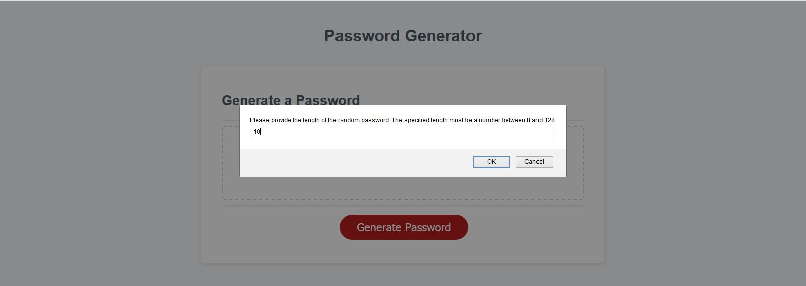

# randomPasswordGenerator

Generates a random password based on provided criteria

The user selects the type of the characters to be included in the password and the length of the password. The provided length must be between 8 and 128.

The user must select at lease one type of character to be included in the password.

A validation is carried out before the password is generated. If the validation fails then user must select again.

Once validation passes and a password is generated, the selected choices are 'remembered' and clicking the 'Generate Password' will generate a different random password for the same selected choice. Please resfresh the page to provide new choices.

